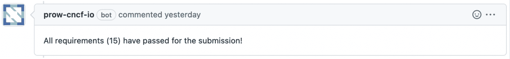
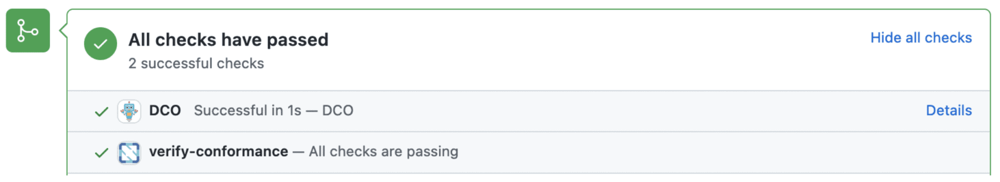
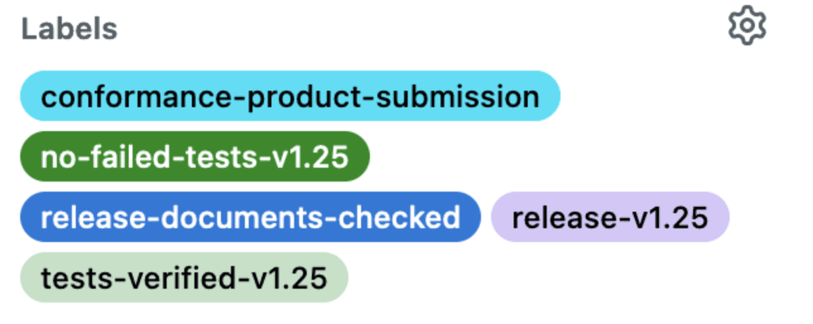
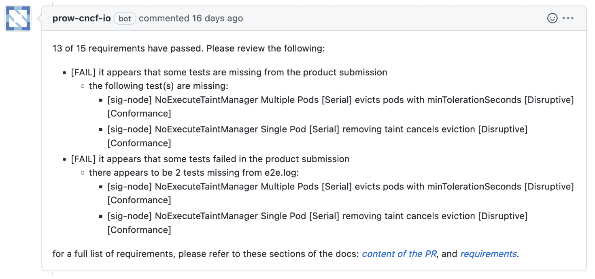
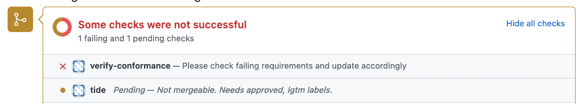
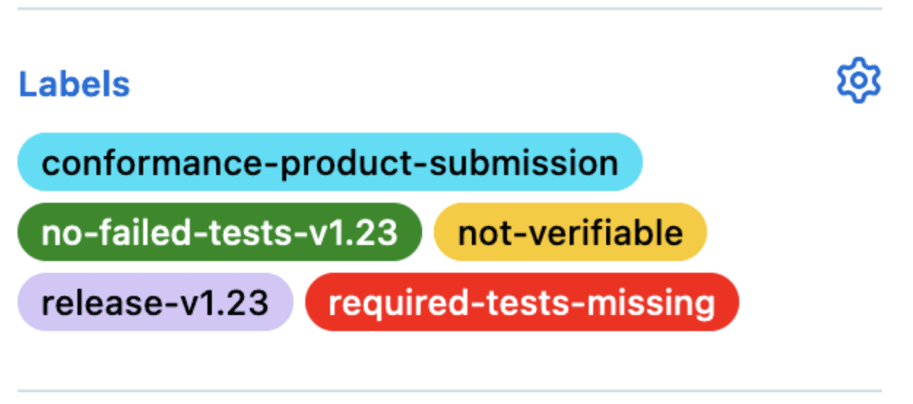

**[BLOG](https://ii.nz/post/) / [COMMUNITY POST](https://ii.nz/post/kubernetes-conformance-updates-for-october-2022/)**

> Cross-posted from https://www.cncf.io/blog/2022/10/19/kubernetes-conformance-updates-for-october-2022/

# Kubernetes conformance updates for October 2022

_By Riaan Kleinhans, Stephen Heywood, Caleb Woodbine_

_19th August 2022_

## Introduction

The Kubernetes Conformance project has been running for a number of years now, recently there are a few minor updates to it and a few things to celebrate.

## Coverage

Looking back at the history of Kubernetes Conformance we need to go back to February 2018 when [Kenichi Omichi](https://github.com/oomichi) dug into the Kubernetes logs and found that Kubernetes had 481 API endpoints, only 53 endpoints, or 11% were covered by tests. Dan Kohn knew that for the [Certified Kubernetes brand](https://github.com/cncf/k8s-conformance/pulls#certified-kubernetes) to have meaning, they needed to invest to make sure test coverage was much higher.

To address the gap in conformance testing Kubernetes Conformance subproject was established and met for the first time on [26 March 2019](https://www.youtube.com/watch?v=uqA1JtRtLXs&list=PL69nYSiGNLP2m6198LaLN6YahX7EEac5g&index=192). The aim for the subproject was to accelerate work on improving conformance test coverage, perform conformance test reviews, develop processes to support the work, prioritize work and discuss test criteria.

The diligent work of test writers and reviewers has paid off, with less than 6% of the endpoints not covered by Conformance tests when 1.25 was released. Also, in that release we finally have 100% coverage for all app endpoints.

Not only was it important to ensure that existing technical debt is being paid off through the delivery of quality conformance tests, but also ensuring that no new technical debt is created through API endpoints graduating to GA without Conformance tests. This is achieved through weekly updates of [APISnoop](https://apisnoop.cncf.io) and careful monitoring of the results.

## Community Operations

Automation is a fundamental value of the Kubernetes community.
For each release, Kubernetes product and distribution owners submit a PR to the k8s-conformance repo in order to certify their product or distribution.

Since around the time of the release of Kubernetes v1.18, a bot was built by Berno Kleinhans and Rob Kielty to automate the checking of the PRs in this repo.
In order to verify conformance, the Kubernetes e2e conformance suite must be run against a cluster.

This is where [sonobuoy](https://github.com/vmware-tanzu/sonobuoy), a community tool from [vmware-tanzu](https://tanzu.vmware.com/) for generating conformance test run data, comes in. When sonobuoy is run, it runs the test suite against a target cluster. Once the suite is complete the e2e.log and junit_01.xml can be collected. These files describe what was run and how it ran.

Each PR has the four following files

- a PRODUCT.yaml; to provide metadata on the product
- an e2e.log: to store the test runner’s logs
- a junit_01.xml: to store a structured list of the tests that were run; and finally
- a README.md: to provide instructions on how the submitter created the cluster and generated results

## Test definitions

I was tasked with the rewrite of the bot. In this rewrite, the behaviour of the bot has been greatly improved as well as the tests made easier to understand.
[Gherkin](https://cucumber.io/docs/gherkin/) is a way to plainly describe features for specifications and implement the code separately. Much earlier before Gherkin was implemented in the Kubernetes conformance bot, Zach Mandeville (also from [ii.nz](https://ii.nz)) had implemented Gherkin in the [XDS test suite](https://github.com/ii/xds-test-harness) through [godog](https://github.com/cucumber/godog). With this inspiration and a keener focus on understandability and maintainability, Gherkin was naturally chosen.

Here is a snippet from the bot’s feature file, to provide very high-level language instructions for the tests for the submissions through the bot:

```feature
  Scenario: all tests pass in e2e.log
    it appears that some tests failed in the product submission

    Given an "e2e.log" file
    Then the tests pass and are successful
    And all required tests in e2e.log are present
```

The scenario above regards that the expected state of all tests pass in the submitted e2e.log file. The second line is the failure message.
The test begins with ensuring that the file e2e.log exists in the PR, it states in an intended way for the outcome that all tests are passing and are successful, finally that all required tests are present.
In Gherkin, there are directives like “Given”, “Then” and “And”. These directives begin declaring lines of the test. After each directive, there’s a statement like “the tests pass and are successful”; Each statement maps to some function in code through an implementation of the feature file, in this case Go functions with Godog.
For instance, the line “Given an “e2e.log” file” matches to a handling function through this regex here

```go
ctx.Step(`^a[n]? "([^"]*)" file$`, s.aFile)
```

then the function that handles the test, checking for a file’s existence

```go
func (s *PRSuite) aFile(fileName string) error {
	file := s.GetFileByFileName(fileName)
	if file == nil {
		return common.SafeError(fmt.Errorf("missing required file '%v'", fileName))
	}
	return nil
}
```

You can find out more about Gherkin, [here](https://cucumber.io/docs/gherkin/) and Godog (the Go implementation) [here](https://github.com/cucumber/godog).

There are currently 15 scenarios, covering requirements like

- required tests present and passing
- title format
- folder structure
- file presence
- values in PRODUCT.yaml
- URL resolution for URLs in PRODUCT.yaml
- amount of commits

and many more.
# Behaviour

The bot will now respond with a single message after each difference on a commit, as well as updating the labels on the PR. Under-the-hood, the bot is now declarative.
Additionally, the bot also updates the status checks at the end of bottom of the PR page.
A successful product submission will result in the following message,



the following checks passing,



and the similar labels




A failing product submission result in a comment something like this,




the following status checks failing



and labels similar to this



These changes have been shown to be incredibly helpful for product submitters, easing the process of submitting and determining potential issues.

## Closing

Overall, the Kubernetes conformance has come along way in the past four years.
The project has almost reached completion and has received some smoother automations and feedback.

You can find out more about the project here

- apisnoop: https://apisnoop.cncf.io
- k8s-conformance repo: https://github.com/cncf/k8s-conformance
- verify-conformance bot repo: https://github.com/cncf-infra/verify-conformance